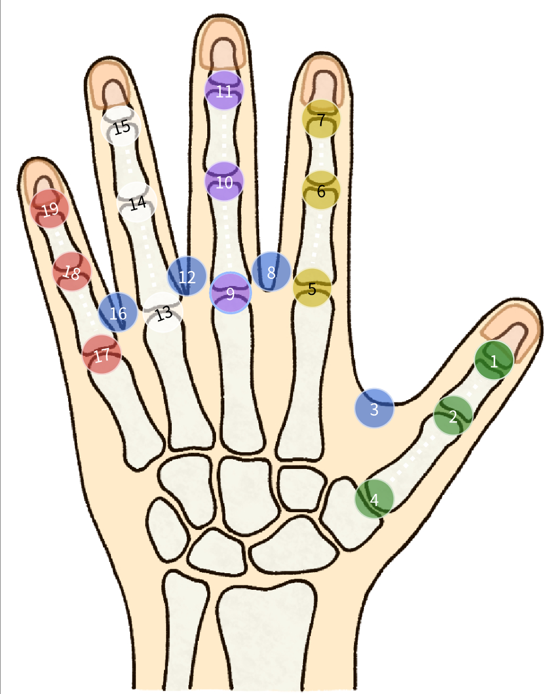

# Frequently Asked Questions

- **What is the accuracy?**

For the flexible sensors inside the gloves, different hand sizes and shapes can significantly affect the range of sensor readings (for example, when wearing gloves of the same size, different people's hands may produce varying readings), thus influencing the accuracy in estimating joint angles. In our product documentation, we will include information about the range of hand sizes corresponding to each glove size (as well as the optimal hand size range for model predictions) to help users determine whether the gloves meet their needs. In our tests, within this ideal range, the average error of joint angle estimation is within *2°* (compared against an optical motion capture system as ground truth). For users with higher precision requirements, we also provide interfaces to raw sensor data, enabling users to develop customized, higher-precision models. We welcome and look forward to users expanding the boundaries of OpenCyberGlove through their own creative approaches.

- **Where are the sensors located?**

The sensors are located at each finger joint (MCP, PIP, DIP) and in the areas between fingers.

  

- **How is the repeatability and linearity of the sensor?**

The reading of flex sensors changes 99% linearly with the extension of the material. In terms of repeatability, after 100 thousand extensions, the readings remain at ≥ 98% of their original value.

- **How to implement my own model for joint angle estimation?**

Currently, this is an open research area. You can develop your own deep learning model by leveraging additional measurement systems (such as motion capture systems or camera-based 3D keypoint detection) to map 3D joint locations to sensor readings. Since we provide access to the raw sensor data interface, users can train custom models optimized for their specific needs and potentially achieve higher accuracy than our default model, which prioritizes generalizability across different users.