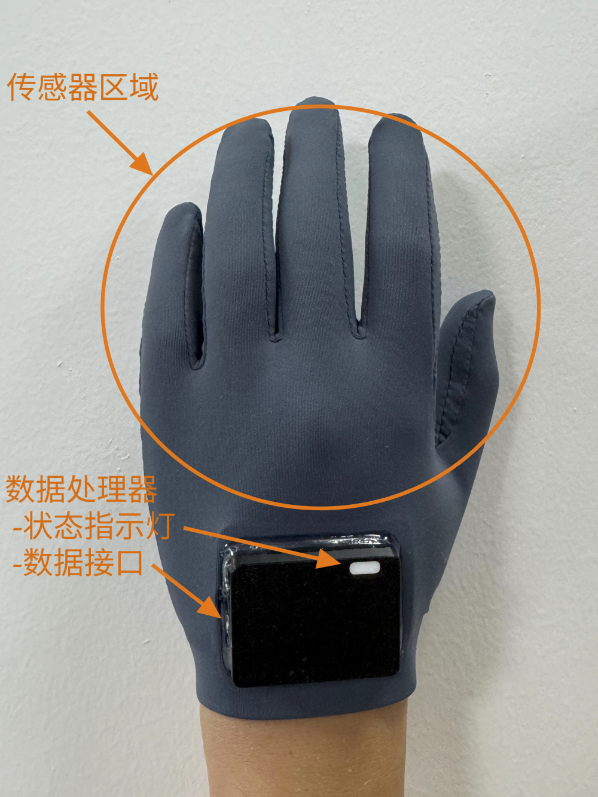
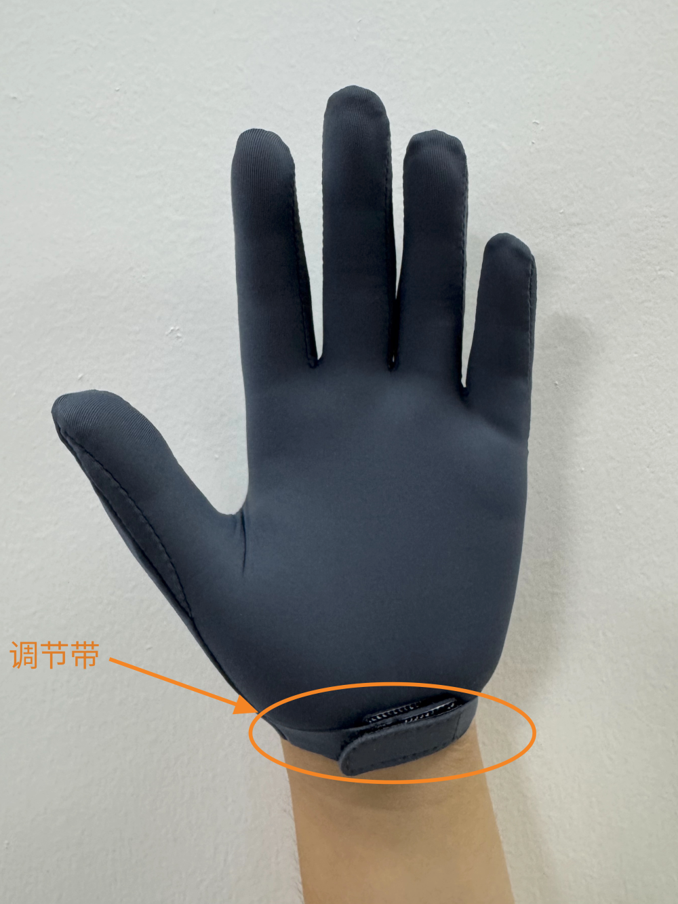
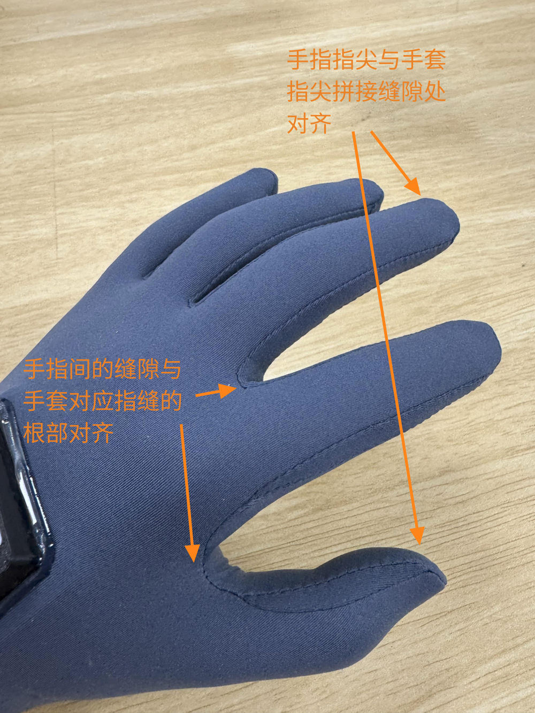
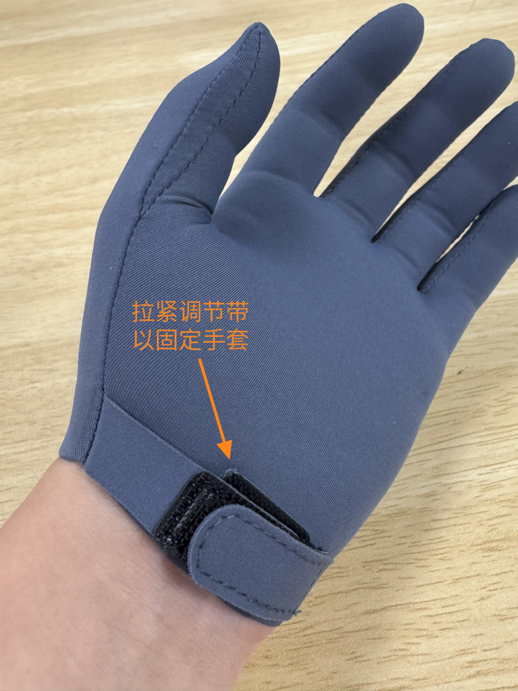
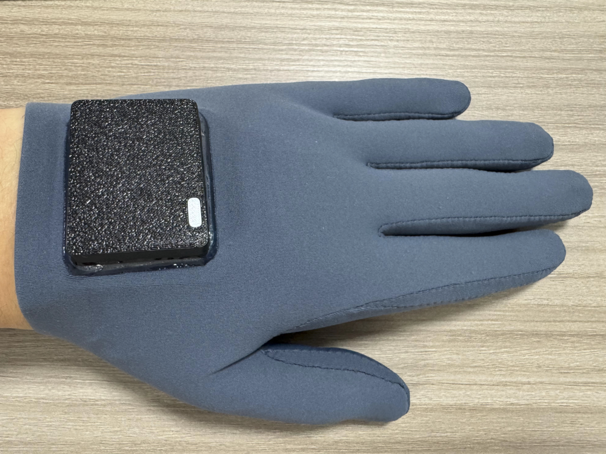

<h1 id="7941282f">可穿戴手套产品使用说明书</h1>

<a href="../user_guide_en">English Version</a>

<h3 id="7a35cca9">第一部分：入门必读</h3>
<h4 id="238f7ae1">1. 封面与开箱清单</h4>

- **产品信息**
    - 产品名称：CyberOrigin Glove
    - 产品图：

  

- **开箱清单**：包装盒内含：
    - 包装收纳盒（一个）
    - CyberOrigin手套 (左右各一只)
    - 数据线 (两根)
    - 快速上手卡片 (一张)

<h4 id="5c40e02e">2. 产品结构解析</h4>
- 产品结构图

  
  

- **各部位名称及功能**：
    - **传感器区域**：捕捉手部动作。
    - **数据处理器**：收集处理传感器数据并传输。左手数据处理器为黑色，右手为白色。
        - **状态指示灯**：显示设备工作状态。
        - **数据接口**：连接数据线。
    - **调节带**：用于固定手套。

<h3 id="aead9984">第二部分：快速上手</h3>
<h4 id="7035de55">1. 步骤一：穿戴</h4>

按照下面步骤正确穿戴手套，以确保传感器精度。 

在穿戴前，请参考下方的尺码表，以确保选择的手套尺寸合适。目前暂不提供L/S尺码手套。

| 尺码 | 手掌维度（mm） | 手腕维度（mm） | 手长（mm） | 中指（mm） | 食指（mm） | 大拇指（mm） | 无名指（mm） | 小指（mm） |
| :--: | :--------: | :--------: | :----: | :----: | :----: | :------: | :------: | :----: |
| M | 80-105 | 155-180 | 180-195 | 77-90 | 67-80 | 55-69 | 67-80 | 50-65 |
| 推荐最佳大小 | 89.2 | 165.9 | 186.6 | 83.7 | 72.3 | 62.5 | 74.8 | 60.0 |

- **指部对位**：带上手套，使手指与指套完全贴合。手指间的缝隙需与手套对应指缝的根部对齐。手指指尖与手套指尖拼接缝隙处对齐。
- **表面抚平**：抚平手套表面，确保传感器区域无扭曲或褶皱。
- **腕部固定**：拉紧调节带以固定手套，确保手腕活动自如。

  
  

  

<h4 id="baf50999">2. 步骤二：连接</h4>
按照下面步骤正确连接手套：

- 使用包装内附带的专用数据线，手套通过数据线供电及传输数据，无需额外电源。
- 将数据线一端接入位于手套的USB-C数据接口，另一端连接至电脑的USB端口。观察状态指示灯判断手套状态。

状态指示灯说明：

- **灯灭**：未通电或未正确连接。
- **绿色常亮**：已通电，等待连接。
- **蓝色呼吸灯**：已连接，处于待命状态。

<h4 id="517c2473">3. 步骤三：校准</h4>
首次连接时，手套将自动引导校准。请按提示完成指定手势，充分放松或激活传感器。当更换使用者或精度下降时，需重新校准。

手势示例如下：

  
  

  
  

<h4 id="45856e61">4. 步骤四：使用</h4>

<h3 id="bwjTg">第三部分：注意事项与日常维护</h3>
<h4 id="f6710224">1. 安全须知</h4>

- **人身安全**：若有不适，立即停用。特殊身体状况者遵医嘱。
- **设备安全**：禁止拉扯数据线、摔落、撞击设备。

<h4 id="54453877">2. 使用环境</h4>

- **工作环境**：室温0°C - 40°C，湿度20% - 80%RH
- **环境干扰**：穿戴前保持手部干净且干燥，使用时避免穿戴和尖锐物品，避免超过300%的拉伸。

<h4 id="8b80f94b">3. 存储事项</h4>

- **存放建议**：长期不用时，请盒内存放于阴凉干燥处，避免阳光直射。
- **避免重压**：禁止重压或与尖锐物品共存，保持自然状态不受挤压或拉伸。

<h4 id="6ccd60d9">4. 清洁保养</h4>

- **清洁方法**：使用柔软无毛湿布擦拭即可。严禁水洗或使用含酒精的清洁剂。
- **接口清洁**：确保接口洁净干燥。
- **注意事项**：清洁前请断开电源并避免接触腐蚀性液体

