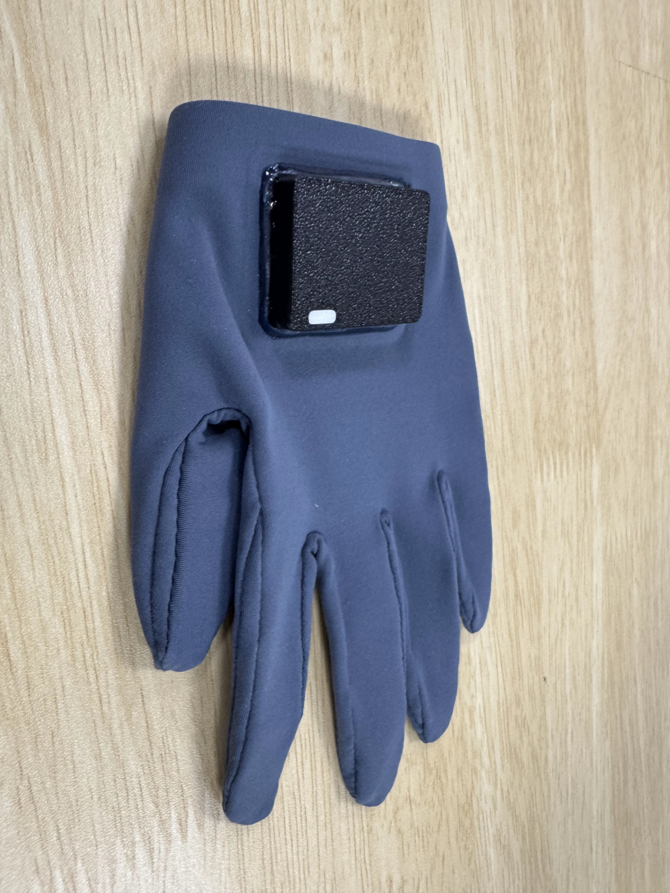
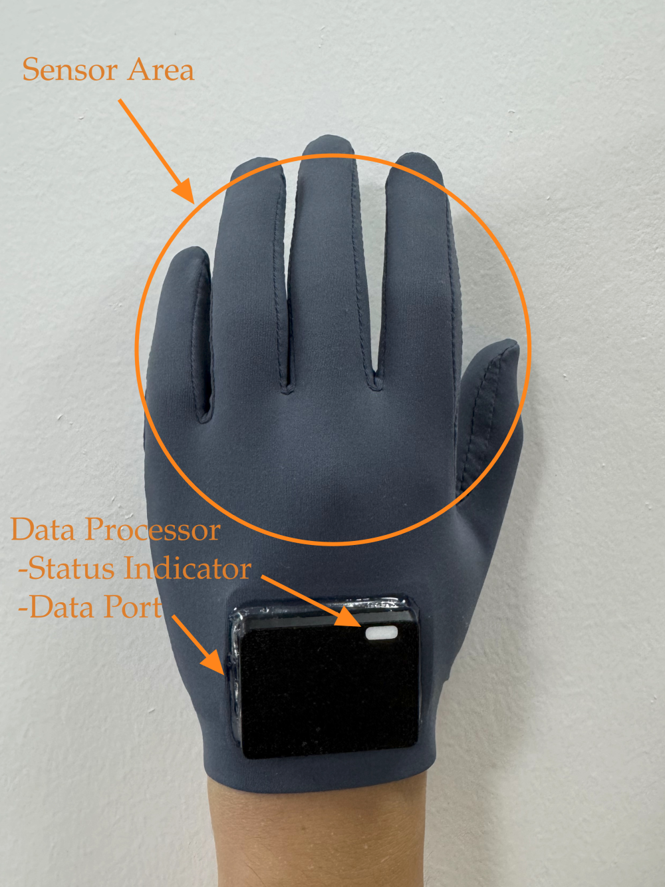
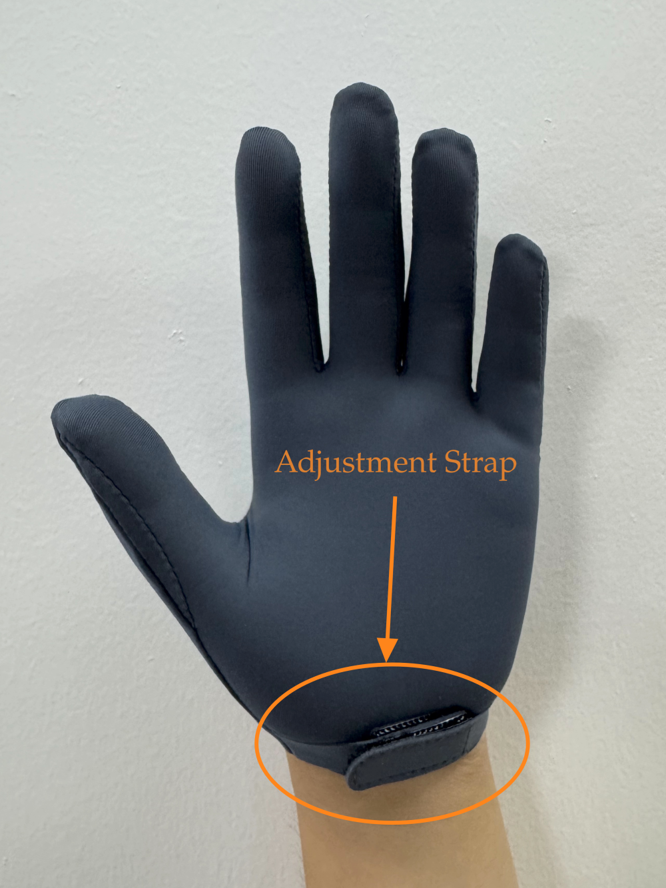
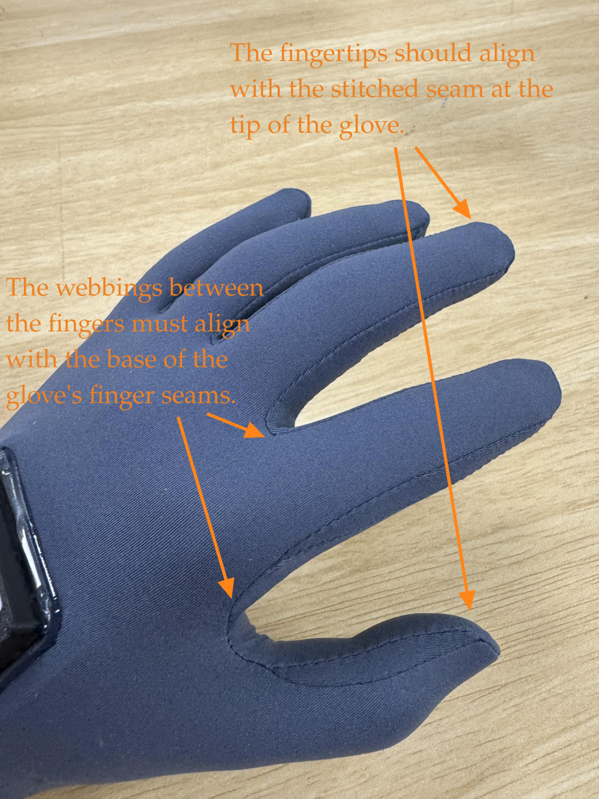
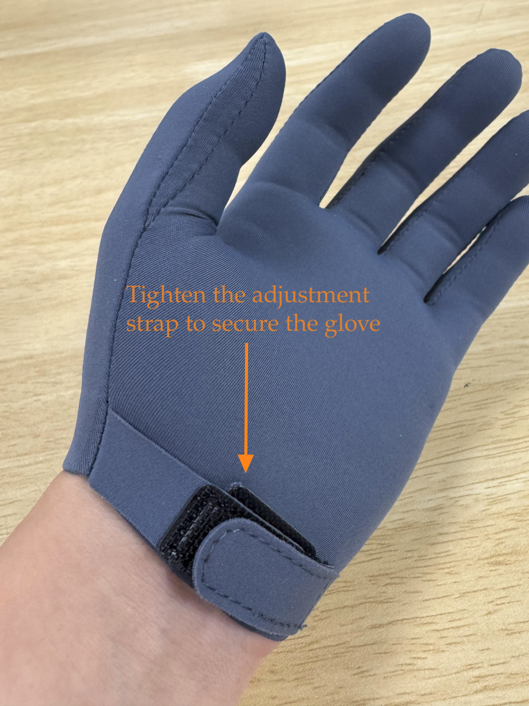
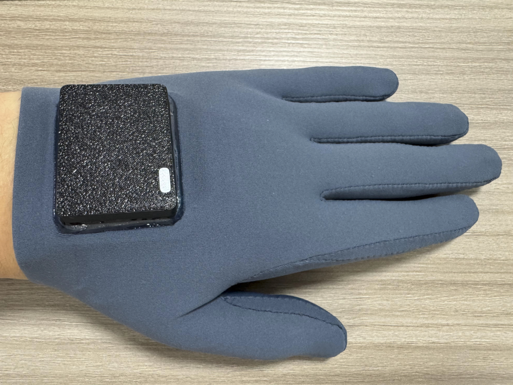
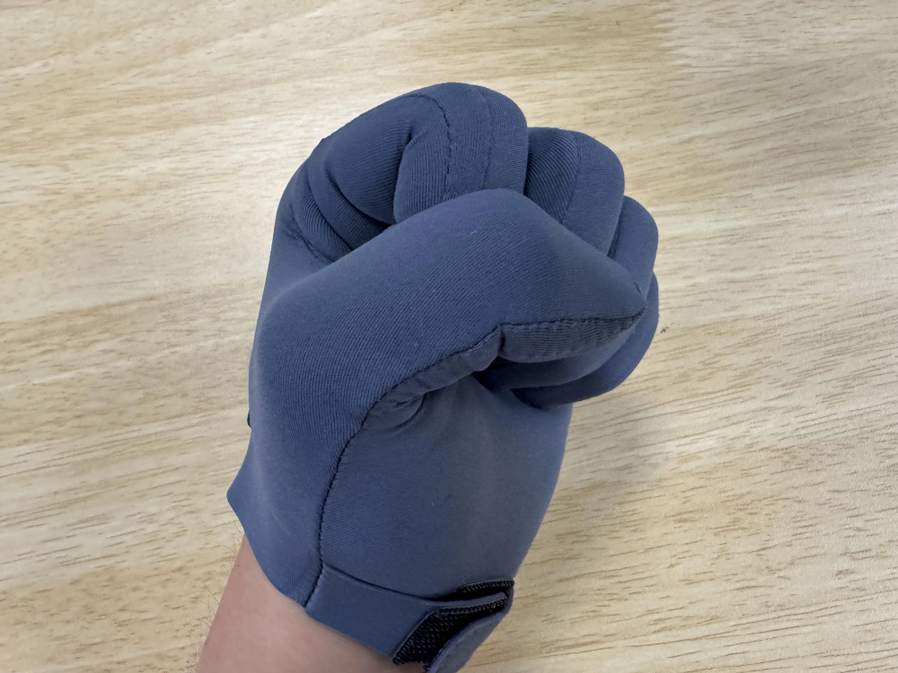

<h1 id="cyberorigin-glove-user-manual">CyberOrigin Glove User Manual</h1>
<h3 id="81cd1d42">Part 1: Getting Started</h3>
<h4 id="1.-cover-and-packing-list">1. Cover and Packing List</h4>

- **Product Information**
    - Product Name: CyberOrigin Glove
    - Product Image:

  

- **Packing List**: The box contains:
    - Storage Case (*1)
    - CyberOrigin Glove (one left, one right)
    - Data Cable (*2)
    - Quick Start Guide (*1)

<h4 id="2.-product-anatomy">2. Product Anatomy</h4>

- Product Diagram:

  
  

- **Part Names and Functions**:
    - **Sensor Area**: Captures hand movements.
    - **Data Processor**: Collects, processes, and transmits sensor data. The left-hand processor is black; the right-hand processor is white.
        - **Status Indicator Light**: Indicates the device's operational status.
        - **Data Port**: For data cable connection.
    - **Adjustment Strap**: Used to secure the glove.

<h3 id="fe975703">Part 2: Quick Start</h3>
<h4 id="93f94a4d">1. Step 1: Wearing</h4>
Follow the steps below to wear the glove correctly to ensure sensor accuracy.

- **Finger Alignment**: Put on the glove, ensuring fingers are fully inserted into their respective slots. The webbings between the fingers must align with the base of the glove's finger seams. The fingertips should align with the stitched seam at the tip of the glove.
- **Surface Smoothing**: Smooth the surface of the glove to ensure there are no twists or wrinkles in the sensor area.
- **Wrist Fastening**: Tighten the adjustment strap to secure the glove, while ensuring freedom of wrist movement.

  
  

  

<h4 id="fd13c0da">2. Step 2: Connection</h4>

Follow the steps below to connect the glove correctly:

- Use the provided dedicated data cable. The glove is powered and transmits data via the data cable; no external power source is required.
- Connect one end of the data cable to the glove's USB-C data port and the other end to the computer's USB port. Observe the status indicator light to determine the glove's status.

**Status Indicator Light Guide:**

- **Light Off**: Not powered on or improperly connected.
- **Solid Green**: Powered on, awaiting connection.
- **Breathing Blue Light**: Connected, in standby mode.

<h4 id="9ec7f7dd">3. Step 3: Calibration</h4>
Upon first connection, the glove will automatically initiate the calibration process. Please follow the on-screen prompts to perform the specified gestures to fully relax or activate the sensors. Recalibration is required when changing users or if a decrease in accuracy is perceived.

Gesture examples are as follows:

  
  

  
  

<h4 id="b7be8e01">4. Step 4: Usage</h4>

<h3 id="2604b548">Part 3: Software Guide</h3>
<h4 id="1.-download-and-installation">1. Download and Installation</h4>

- **Download Channel**: Visit the official website www.cyberorigin.ai to download the companion software and SDK.
- **Minimum System Requirements**:
    - Windows
    - Linux

<h4 id="ae0372ed">2. Software/SDK Setup</h4>

<h3 id="b24c9938">Part 4: Precautions and Daily Maintenance</h3>
<h4 id="1.-safety-notices">1. Safety Notices</h4>

- **Personal Safety**: If discomfort occurs, discontinue use immediately. Individuals with special medical conditions should follow medical advice.
- **Device Safety**: Do not pull the data cable, drop, or subject the device to impact.

<h4 id="2.-operating-environment">2. Operating Environment</h4>

- **Working Environment**: Room temperature 0°C - 40°C, humidity 20% - 80%RH.
- **Environmental Factors**: Keep hands clean and dry before wearing. Avoid contact with sharp objects and stretching beyond 300% while in use.

<h4 id="3.-storage">3. Storage</h4>

- **Storage Recommendations**: When not in use for extended periods, store in the case in a cool, dry place, away from direct sunlight.
- **Avoid Pressure**: Do not place heavy objects on the device or store it with sharp items. Keep it in its natural state without being compressed or stretched.

<h4 id="4.-cleaning-and-maintenance">4. Cleaning and Maintenance</h4>

- **Cleaning Method**: Wipe with a soft, lint-free, damp cloth. Do not wash or use cleaners containing alcohol.
- **Port Cleaning**: Ensure the port is clean and dry.
- **Precautions**: Disconnect from power before cleaning and avoid contact with corrosive liquids.

<h3 id="c98c3e3b">Part 5: Support and Service</h3>
<h4 id="805d0475">1. Frequently Asked Questions (FAQ)</h4>

- **Connection Issues**:
    - **Q**: The computer does not recognize the device?
    - **A**: Try changing the USB port or restarting the computer; ensure the original data cable is used.
- **Usage Issues**:
    - **Q**: Inaccurate recognition or latency?
    - **A**: Recalibrate; check for environmental interference.

<h4 id="2.-after-sales-service-and-technical-support">2. After-Sales Service and Technical Support</h4>

- **Contact Information**:
    - Customer Service Phone: 
    - Email: 
    - Online Support: 
- **Warranty Policy**: For detailed warranty terms, refer to the warranty card or the official website.

<h4 id="3.-appendix">3. Appendix</h4>

- **Technical Specifications**: [Include parameters such as weight, dimensions, power supply method, port type, sensor type, etc.]
- **Regulatory and Compliance Information**: [Enter Regulatory Information]
- **Hazardous Substances Information**: [Enter Hazardous Substances Table]
